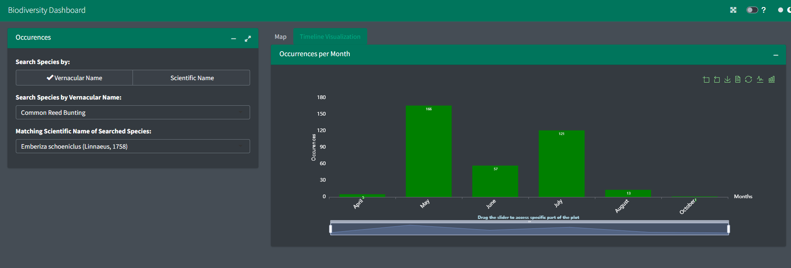

<!-- README.md is generated from README.Rmd. Please edit that file -->

# 🌿 BiodiversityDashboard

<!-- badges: start -->

[](https://github.com/Ramdhadage/BiodiversityDashboard)
[](https://github.com/Ramdhadage/BiodiversityDashboard)
[](https://ramdhadage.github.io/BiodiversityDashboard/)

<!-- badges: end -->



> An interactive Shiny application that visualizes biodiversity data on
> maps and timelines, helping researchers and enthusiasts explore
> species distributions and observation patterns.

## 📋 Table of Contents

<details open>
<summary>
Click to expand/collapse
</summary>

- [📖 About The Project](#-about-the-project)
  - [✨ Features](#-features)
  - [🚀 Installation](#-installation)
  - [🖥️ Live Demo](#-live-demo)
  - [📊 Example](#-example)
  - [🗺️ Roadmap](#-roadmap)
  - [📚 Documentation](#-documentation)
  - [🤝 Contributing](#-contributing)
  - [📜 License](#-license)

</details>

## 📖 About The Project

The Biodiversity Dashboard is a sophisticated Shiny application designed
to visualize and explore biodiversity data. It allows users to search
for species by scientific or vernacular names and displays observation
data on interactive maps and timeline visualizations.

## ✨ Features

- **Interactive Species Search**: Find species using scientific or
  vernacular names
- **Dynamic Map Visualization**: View species observations
  geographically
- **Temporal Analysis**: Explore when species were observed through
  timeline visualizations
- **Fast Performance**: Optimized for quick initialization and
  responsive interactions
- **Modern UI**: Styled with CSS/Sass for an enhanced user experience

## 🚀 Installation

You can install the development version of BiodiversityDashboard from
[GitHub](https://github.com/Ramdhadage/BiodiversityDashboard):

``` r
# Install remotes if you haven't already
if (!requireNamespace("remotes", quietly = TRUE)) {
  install.packages("remotes")
}

# Install BiodiversityDashboard
remotes::install_github("Ramdhadage/BiodiversityDashboard")
```

## 🖥 Live Demo

Try the BiodiversityDashboard directly in your browser: [click on
me](https://ramdhadage.github.io/BiodiversityDashboard/)

## 📊 Example

Launch the dashboard with a single function call:

``` r
 BiodiversityDashboard::run_bd_app()
```

<!-- ROADMAP -->

## 🗺️ Roadmap

### Completed Features ✅

- **Species Search Functionality:**  

  Users can search for species using scientific or vernacular names. The
  application displays observations on the map after search returns
  matching names.

- **Informative Default View**  
  Default view presents meaningful data rather than an empty map and
  plot.

- **Timeline Visualization**  
  Visualization of temporal patterns when selected species were
  observed.

- **Public Deployment**  
  Available on
  [github.io](https://ramdhadage.github.io/BiodiversityDashboard/)

- **Modular Architecture**  
  Implemented Shiny modules: `mod_loadData`,
  `mod_timelineVisualization`, and `mod_viewMap`.

- **Test Coverage**  
  Added unit tests for critical functions and edge cases.

- **Enhanced Styling**  
  Used [fresh](https://dreamrs.github.io/fresh/index.html) with Sass for
  improved aesthetics.

- **Performance Optimization**

  - Shiny caching for application performance

  - [memoise](https://github.com/r-lib/memoise) for function memoization

  - Fast data loading with `data.table::fread()`

  - Internal data storage in `sysdata.rda`

  - Server-side-selectize inputs

  - JavaScript libraries (Echarts4r, leaflet) for visualization

  - shinyWidgets for input components

- **JavaScript Visualizations**  
  Used JavaScript for map popups, labels, and monthly occurrence plots.

- **Dynamic UI Module**  
  Created separate module for species selection based on name typ

- **Code Refactoring**  
  Functions for `dropdownBasedOnRadioBtn` and
  `updatedropdownBasedOnRadioBtn`, numbered modules, dark mode support.

### Upcoming Features 🔜

- **Enhanced JavaScript Integration**  
  Implement rich media elements in popups, interactive labels, and
  loading spinners through custom JavaScript for a more engaging user
  experience.

- **Comprehensive Test Coverage**  
  Expand unit testing to cover additional functions and edge cases,
  ensuring robust application behavior across all scenarios.

- **CI/CD with GitHub Actions**  
  Implement automated workflows for continuous integration and
  deployment, including:

  - Automated R CMD check across multiple operating systems
  - Code coverage reporting
  - Automated package testing on pull requests
  - Seamless deployment to GitHub Pages and shinyapps.io

- **Modern UI with bslib**  
  Transition from bs4Dash to bslib for a more polished interface,
  leveraging:

  - Bootstrap 5 components and utilities
  - Custom theming with Sass variables
  - Responsive card-based layouts
  - Improved dark mode implementation

- **Comprehensive Documentation**  
  Create and deploy extensive documentation including:

  - Function reference with examples
  - User guides with vignettes
  - Developer guidelines
  - Interactive tutorials
  - Automated deployment to GitHub Pages using pkgdown

- **Expanded Testing**  
  Add more test cases for broader function coverage.

## 📚 Documentation

For more detailed information and usage examples, please refer to the
[package
documentation](https://github.com/Ramdhadage/BiodiversityDashboard).

## 🤝 Contributing

Contributions are welcome! Please feel free to submit a Pull Request or
open an Issue on our [GitHub
repository](https://github.com/Ramdhadage/BiodiversityDashboard).

## 📜 License

This project is licensed under the MIT License.

<p align="right">

(<a href="#top">back to top</a>)

</p>

\`
